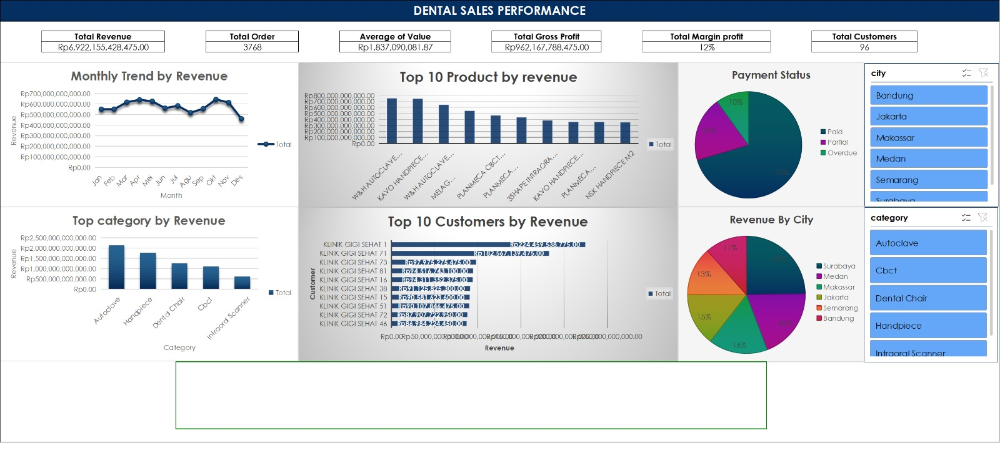

# Dental Sales Performance Dashboard (Microsoft Excel)

Interactive sales dashboard built using Microsoft Excel to analyze sales performance, customer behavior, and operational reporting metrics.

## Project Overview

This project analyzes sales transaction data to monitor revenue trends, customer activity, and operational performance. The dashboard provides business insights through interactive visualizations and KPI monitoring to support data-driven decision making.

## Business Objectives

- Monitor sales performance and operational activities.
- Analyze customer purchasing trends and sales reporting.
- Track revenue performance and order activity.
- Improve reporting efficiency through dashboard visualization.
- Support operational monitoring and business decision making.

## Dataset Summary

| Dataset | Records |
|--------|--------:|
| Sales Transactions | 3,768 |
| Customers | 98 |
| Products | 19 |

## Key Performance Indicators (KPIs)

- Total Revenue
- Total Orders
- Average Order Value
- Customer Activity
- Sales Trends

## Dashboard Features

- Sales performance analysis
- Revenue monitoring
- Customer activity tracking
- Monthly sales trends
- Product performance analysis
- Interactive slicers and filters
- KPI monitoring dashboard

## Tools Used

- Microsoft Excel
- Pivot Tables
- Pivot Charts
- XLOOKUP
- Slicers
- Data Cleaning

## Files Included

- dental-sales-dashboard.xlsx — Excel workbook containing the dataset and interactive dashboard.
- dashboard-preview.png — Screenshot of the dashboard visualization.

## Dashboard Preview

## Key Insights

- Identified top-performing products contributing the highest sales.
- Analyzed customer purchasing activity and sales trends.
- Evaluated operational performance through KPI monitoring.
- Improved reporting readability using dashboard visualization.

## Skills Demonstrated

- Data Cleaning
- Dashboard Development
- KPI Reporting
- Sales Analysis
- Operational Reporting
- Data Visualization
- Business Insight Generation

## Author

Alnanda Muhammad Rafi

- LinkedIn: https://linkedin.com/in/alnandarafi
